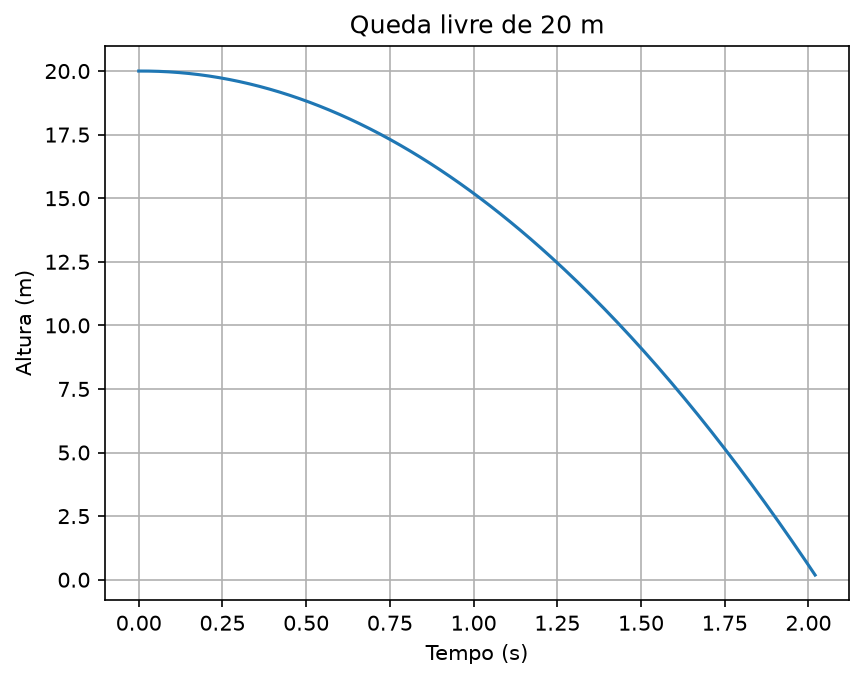
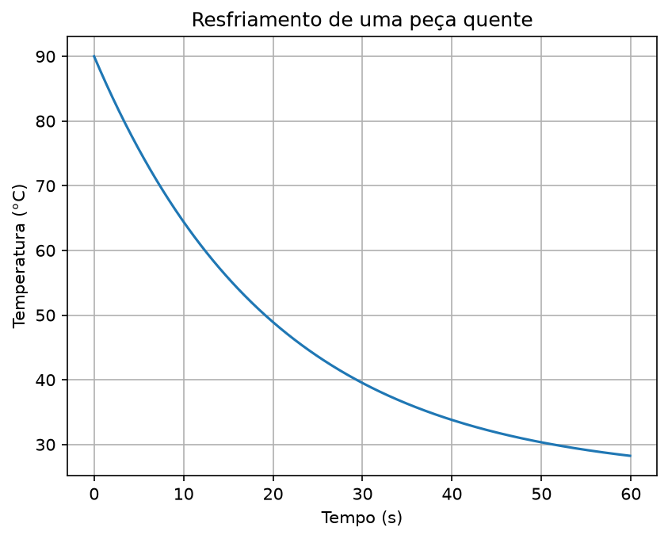
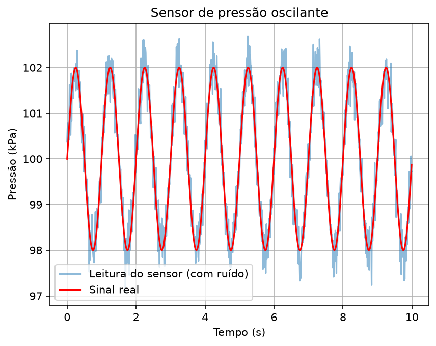

# P01 — Simulador de física no Python

Status: ✅ Concluído

## Sinopse
O ponto de partida da jornada. Este projeto usa Python para simular três fenômenos físicos simples que aparecem em processos industriais: queda livre, resfriamento de um material (Lei de Newton do resfriamento) e a oscilação de um sensor de pressão com ruído de medição. O objetivo não foi criar um simulador complexo, mas aprender a pensar em dados como representações de fenômenos reais, escrever funções reutilizáveis e organizar um projeto Python do zero.

## Dataset
Nenhum — todos os dados foram gerados por simulação própria, a partir das equações físicas de cada fenômeno.

## Resultados

### Parte 1 — Queda livre
Simulação da posição de um objeto em queda livre, a partir de $y(t) = y_0 - \frac{1}{2}g t^2$.

### Parte 2 — Resfriamento de Newton
Simulação do resfriamento de uma peça quente até a temperatura ambiente, a partir de $T(t) = T_{ambiente} + (T_0 - T_{ambiente})e^{-kt}$.

### Parte 3 — Sensor de pressão com ruído
Simulação de um sinal periódico (sensor de pressão oscilando) e da leitura correspondente de um sensor real, com ruído de medição sobreposto ao sinal.

## O que este projeto trouxe
- Escrever funções Python reutilizáveis e documentadas, com parâmetros e valores padrão.
- Usar `numpy` para gerar e manipular arrays de forma vetorizada (sem laços manuais).
- Usar `matplotlib` para visualizar e salvar gráficos.
- A diferença entre **sinal** (o fenômeno físico real) e **medição** (o que um sensor de fato registra, com ruído) — uma ideia central que vai reaparecer em praticamente todo projeto a partir do P03, quando os dados passam a vir de sensores reais.

## Próximo passo
**P02 — Banco de dados de experimentos físicos**: os dados simulados aqui vão ganhar um lugar pra serem armazenados e consultados, como aconteceria num laboratório ou numa fábrica de verdade.

## Estrutura
- `notebooks/` — notebook Jupyter (VSCode) deste projeto: [`P01_simulador_fisica.ipynb`](notebooks/P01_simulador_fisica.ipynb)
- `data/` — dados usados (arquivos grandes ficam de fora do Git, veja `.gitignore`)
- `images/` — gráficos exportados pelo notebook, usados neste README

