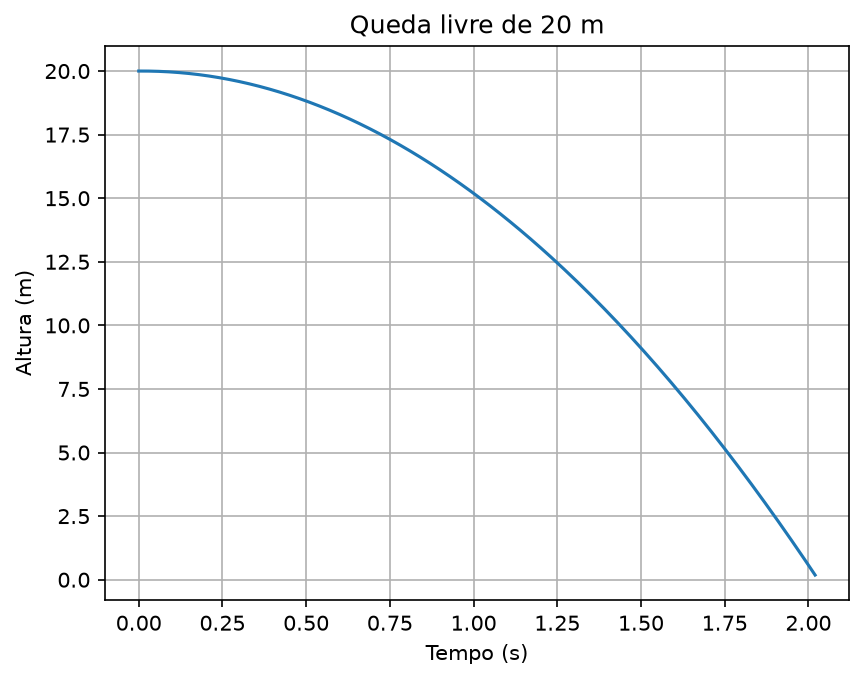
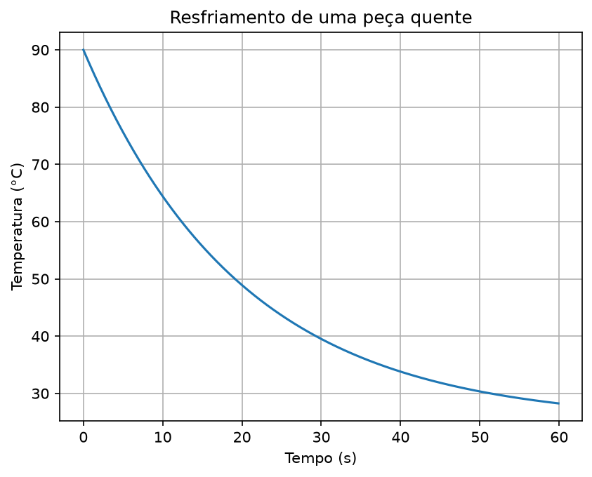
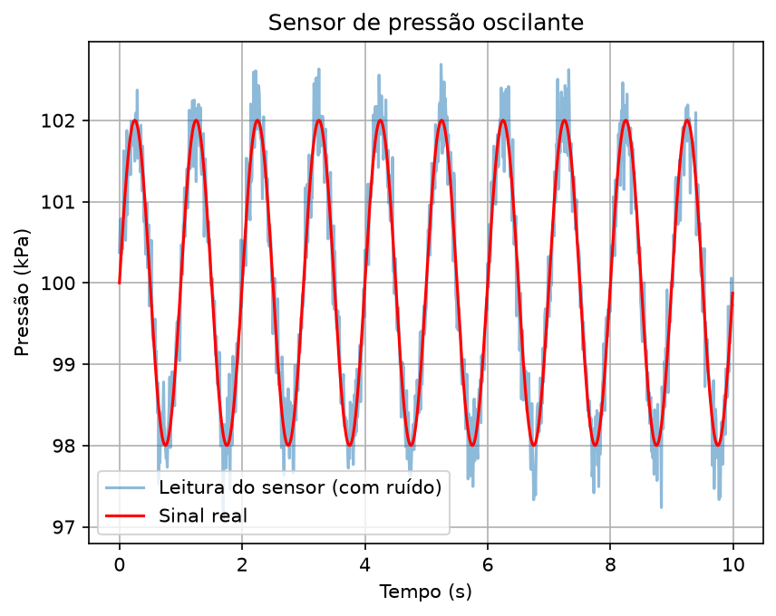

# P01. Simulador de física no Python

**Nº 1 de 48 na ordem de execução.** ID do projeto: P01.

**Cursos da Alura a fazer antes deste projeto (todos os que caem aqui na ordem das 4 carreiras):**
- CD/Base-01 a 03 - lógica de programação e Python para dados (primeiros passos, funções e estruturas)

Simulação de três fenômenos físicos que aparecem em processos industriais: queda livre, resfriamento de
um material (lei de Newton do resfriamento) e a oscilação de um sensor de pressão com ruído de medição.
Não é um simulador complexo. O objetivo era aprender a tratar dado como representação de um fenômeno
real, escrever funções reutilizáveis e organizar um projeto Python do zero.

## Os dados

Não há dataset. Tudo é gerado por simulação, a partir das equações de cada fenômeno.

## Queda livre

Posição de um objeto em queda livre, a partir de $y(t) = y_0 - \frac{1}{2}g t^2$.



## Resfriamento de Newton

Uma peça quente esfriando até a temperatura ambiente, a partir de
$T(t) = T_{ambiente} + (T_0 - T_{ambiente})e^{-kt}$.



## Sensor de pressão com ruído

Um sinal periódico (o sensor de pressão oscilando) e a leitura correspondente de um sensor real, com
ruído de medição sobreposto ao sinal.



## O que ficou

Funções Python reutilizáveis, com parâmetros e valores padrão. `numpy` para gerar e manipular arrays sem
laços manuais, e `matplotlib` para visualizar e salvar os gráficos. A ideia que mais pesa daqui para a
frente é a diferença entre sinal (o fenômeno físico) e medição (o que o sensor de fato registra, com
ruído), porque a partir do projeto 3 os dados passam a vir de sensores reais.

## Como rodar

```bash
pip install numpy matplotlib jupyter
jupyter notebook notebooks/P01_simulador_fisica.ipynb
```

O próximo projeto guarda dados simulados como estes num banco SQLite e consulta com SQL.
